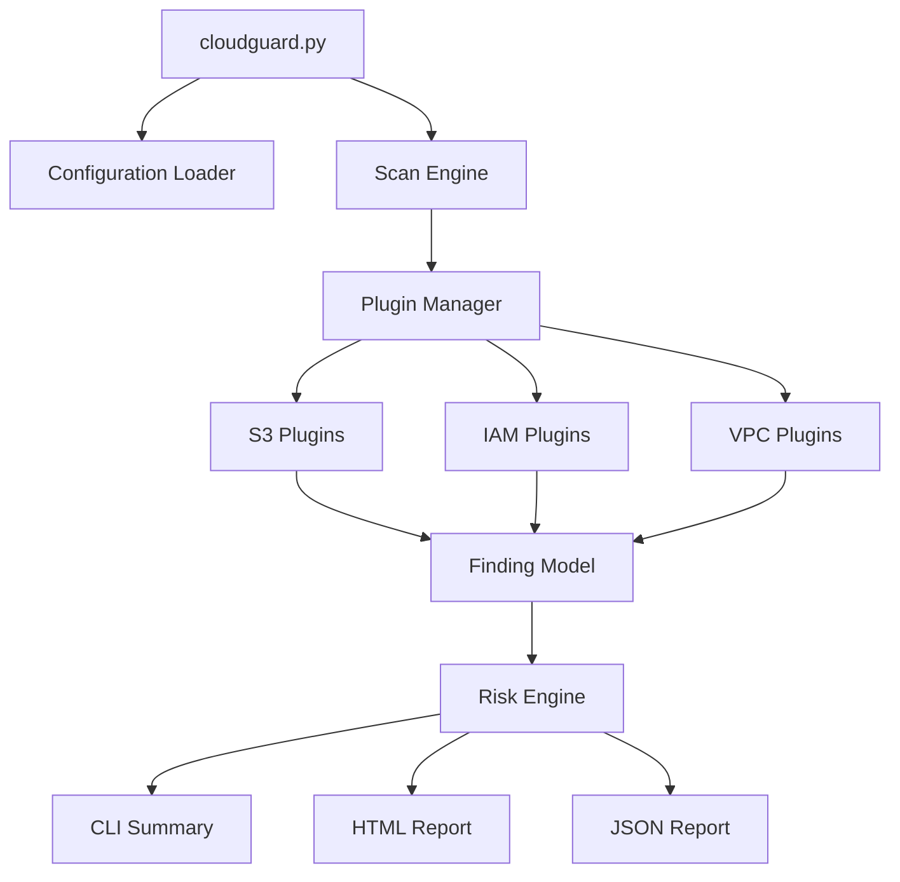
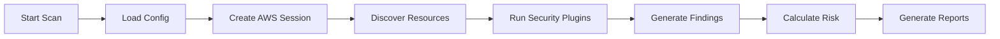
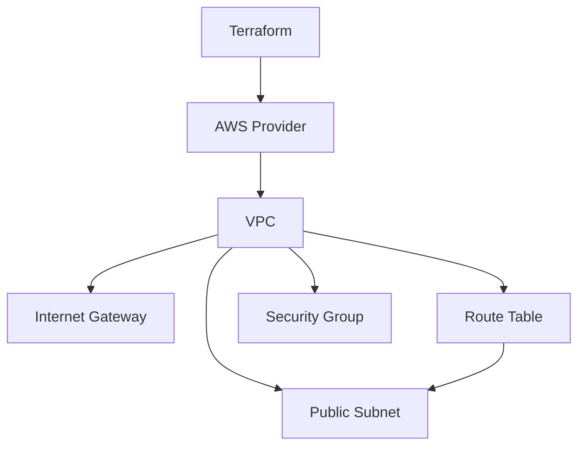

# CloudGuard

[](https://github.com/MohsanRazaq/CloudGuard/actions)

> **A modular AWS cloud security scanner that discovers common misconfigurations, evaluates risk, and produces actionable security findings.**

CloudGuard is a hands-on **Cloud Security Posture Management (CSPM) prototype** built with Python, boto3, and AWS APIs.

The project is designed to understand how cloud security tooling works internally:

**resource discovery → security checks → findings → risk scoring → reporting**

Current AWS coverage includes **S3, IAM, and VPC**, with a plugin-based architecture designed for future expansion.

---

## Table of Contents

- [What CloudGuard Does](#what-cloudguard-does)
- [Why CloudGuard](#why-cloudguard)
- [Current Capabilities](#current-capabilities)
- [Architecture](#architecture)
- [Dynamic Plugin System](#dynamic-plugin-system)
- [How a Scan Works](#how-a-scan-works)
- [Security Checks](#security-checks)
- [Risk Scoring](#risk-scoring)
- [Infrastructure Lab](#infrastructure-lab)
- [Project Structure](#project-structure)
- [Quick Start](#quick-start)
- [AWS Permissions](#aws-permissions)
- [Testing](#testing)
- [Example Findings](#example-findings)
- [Reports](#reports)
- [Screenshots](#screenshots)
- [Roadmap](#roadmap)
- [Security Notes](#security-notes)
- [Why I Built CloudGuard](#why-i-built-cloudguard)

---

## What CloudGuard Does

CloudGuard connects to AWS through **boto3**, discovers cloud resources, runs independent security checks, converts failed checks into standardized findings, calculates risk, and generates reports.

```text
                         AWS Account
                              │
                              │ boto3 / AWS APIs
                              ▼
                    ┌─────────────────────┐
                    │     CloudGuard      │
                    │    Scan Engine      │
                    └──────────┬──────────┘
                               │
             ┌─────────────────┼─────────────────┐
             ▼                 ▼                 ▼
        ┌─────────┐       ┌─────────┐       ┌─────────┐
        │   S3    │       │   IAM   │       │   VPC   │
        │ Scanner │       │ Scanner │       │ Plugins │
        └────┬────┘       └────┬────┘       └────┬────┘
             │                 │                 │
             └─────────────────┼─────────────────┘
                               ▼
                       ┌───────────────┐
                       │   Findings    │
                       │ + Severity    │
                       └───────┬───────┘
                               ▼
                       ┌───────────────┐
                       │ Risk Scoring  │
                       └───────┬───────┘
                               ▼
                 ┌─────────────┼─────────────┐
                 ▼             ▼             ▼
              CLI Output    HTML Report   JSON Report
```

---

## Why CloudGuard?

Cloud environments can become difficult to secure as infrastructure grows. A small configuration mistake can create significant exposure.

CloudGuard currently looks for conditions such as:

- Publicly exposed network resources
- Security Groups allowing unrestricted traffic
- Network ACLs allowing unrestricted inbound traffic
- IAM users without MFA
- Weak S3 configuration
- Disabled S3 versioning
- Missing server access logging

The goal is to turn raw AWS configuration into security information that is easier to understand and prioritize.

### From AWS API data to a security finding

```text
AWS API response
       │
       ▼
Security logic
       │
       ▼
Standardized Finding
       │
       ▼
Severity
       │
       ▼
Risk score
       │
       ▼
Actionable report
```

---

# Current Capabilities

## AWS Services

| AWS Service | Current Coverage |
|---|---|
| **S3** | Bucket security assessment |
| **IAM** | MFA and access-key security assessment |
| **VPC** | Network exposure assessment |

## S3 Security Checks

- Bucket versioning
- Server-side encryption
- Bucket ACL configuration
- Public Access Block
- Bucket policy analysis
- Server access logging

## IAM Security Checks

- IAM user MFA status
- IAM access-key usage / last-used information

## VPC Security Checks

- VPC discovery
- Public subnet exposure
- Security Group exposure
- Network ACL analysis
- IPv4 public-source detection
- IPv6 public-source detection
- Protocol and port classification
- NACL rule-number evaluation
- Inbound ALLOW/DENY evaluation

## Platform Features

- Dynamic plugin discovery
- Plugin registry
- Common plugin interface
- Modular security checks
- Standardized finding objects
- Severity classification
- Risk scoring
- CLI reporting
- HTML reporting
- JSON reporting
- Configurable scan modules
- Logging
- Streamlit dashboard
- Pytest test suite
- GitHub Actions CI
- Terraform-based AWS lab infrastructure

---

# Architecture

CloudGuard separates **scanning**, **security logic**, **risk analysis**, and **reporting**.



### Core architectural layers

| Layer | Responsibility |
|---|---|
| **Entry Point** | Starts the CloudGuard scan |
| **Configuration** | Controls enabled scan modules |
| **Scan Engine** | Coordinates the scanning process |
| **Plugin Manager** | Discovers and loads security plugins |
| **AWS Scanners** | Handle AWS sessions and resource discovery |
| **Security Plugins** | Perform individual security checks |
| **Finding Model** | Gives every result a consistent structure |
| **Risk Engine** | Converts findings into risk scores |
| **Reporting** | Presents results through CLI, HTML, and JSON |
| **Dashboard** | Provides a visual interface for scan results |

---

# Dynamic Plugin System

A key design decision is that the core scan engine should not need to know every individual security check.

Plugins follow a common interface and can be discovered and registered by the plugin manager.

```text
                    Plugin Manager
                          │
              ┌───────────┼───────────┐
              ▼           ▼           ▼
           S3 Plugin   IAM Plugin   VPC Plugin
              │           │           │
              ▼           ▼           ▼
           S3 Check    IAM Check    VPC Check
              │           │           │
              └───────────┼───────────┘
                          ▼
                       Finding
```

### Why this matters

Adding a new security check should primarily involve adding a new plugin rather than rewriting the core orchestration logic.

This provides:

- Lower coupling between components
- Easier testing
- Easier feature development
- Independent security checks
- A foundation for additional AWS services
- A path toward multi-cloud support

---

# How a Scan Works



### Step-by-step

**1. Load configuration**  
CloudGuard reads enabled scan modules from `config.json`.

**2. Create AWS session**  
CloudGuard uses boto3 and the standard AWS credential chain to authenticate with AWS.

**3. Discover resources**  
Relevant scanners discover resources such as S3 buckets, IAM users, VPCs, subnets, Security Groups, and Network ACLs.

**4. Run security checks**  
Each plugin evaluates a specific security property.

**5. Generate findings**  
A failed check becomes a structured finding containing information such as the resource, issue, severity, and recommendation.

**6. Calculate risk**  
Findings are aggregated into a security score and overall risk level.

**7. Generate reports**  
Results can be displayed in the terminal and exported as HTML or JSON.

---

# Security Checks

| Service | Check | Status |
|---|---|---|
| S3 | Bucket Versioning | ✅ Implemented |
| S3 | Encryption | ✅ Implemented |
| S3 | ACL Review | ✅ Implemented |
| S3 | Public Access Block | ✅ Implemented |
| S3 | Bucket Policy | ✅ Implemented |
| S3 | Server Access Logging | ✅ Implemented |
| IAM | MFA Audit | ✅ Implemented |
| IAM | Access Key Audit | ✅ Implemented |
| VPC | VPC Discovery | ✅ Implemented |
| VPC | Public Subnet Exposure | ✅ Implemented |
| VPC | Security Group Exposure | ✅ Implemented |
| VPC | Network ACL Analysis | ✅ Implemented |

---

# Risk Scoring

CloudGuard converts security findings into a simple security posture score.

The current model starts at **100** and deducts points according to finding severity.

| Severity | Deduction |
|---|---:|
| Critical | 25 |
| High | 10 |
| Medium | 5 |
| Low | 2 |

The score cannot fall below `0`.

### Overall risk level

| Score | Risk Level |
|---:|---|
| 90–100 | LOW |
| 70–89 | MEDIUM |
| < 70 | HIGH |

> The scoring model is intentionally simple at this stage. Future versions can incorporate resource criticality, exploitability, finding frequency, and service-specific weighting.

---

# Infrastructure Lab

CloudGuard includes a Terraform-based AWS lab under:

```text
Infrastructure/
└── terraform/
```

The current Terraform configuration provides the foundation for a controlled AWS security-testing environment, including:

- VPC
- Internet Gateway
- Public subnet
- Route table
- Route table association
- Security Group



The purpose of this lab is to test CloudGuard against infrastructure with known security conditions rather than relying only on arbitrary AWS resources.

### Infrastructure → Scanner workflow

```text
Terraform
   │
   ▼
Create Lab Infrastructure
   │
   ▼
Represent known security conditions
   │
   ▼
Run CloudGuard
   │
   ▼
Detect findings
   │
   ▼
Validate scanner behavior
```

This makes the security scanner development process more repeatable and gives the project an infrastructure-as-code testing foundation.

---

# Project Structure

```text
CloudGuard/
│
├── cloudguard.py                 # Main CLI entry point
├── plugin_manager.py             # Dynamic plugin discovery/registration
├── config.json                   # Scan configuration
├── requirements.txt              # Python dependencies
│
├── cloudguard/
│   ├── aws/
│   │   ├── session.py            # AWS session/client handling
│   │   ├── s3_scanner.py         # S3 resource discovery
│   │   └── iam_scanner.py        # IAM resource discovery
│   │
│   ├── findings.py               # Standardized finding model
│   ├── posture.py                # Security posture handling
│   ├── risk.py                   # Risk calculation logic
│   ├── risk_aggregator.py        # Finding/risk aggregation
│   ├── constants.py              # Shared constants
│   │
│   ├── reporting/
│   │   ├── summary.py            # CLI summary
│   │   ├── html_exporter.py      # HTML report generation
│   │   └── json_exporter.py      # JSON report generation
│   │
│   └── utils/
│       ├── config_loader.py      # Configuration loading
│       └── logger.py             # Logging utilities
│
├── plugins/
│   ├── s3/                       # S3 security plugins
│   ├── iam/                      # IAM security plugins
│   └── vpc/                      # VPC security plugins
│
├── dashboard/
│   └── app.py                    # Streamlit dashboard
│
├── Infrastructure/
│   ├── variables.tf              # Terraform input variables
│   └── terraform/
│       ├── main.tf
│       ├── outputs.tf
│       └── versions.tf
│
├── tests/
│   ├── s3/                       # S3 tests
│   ├── iam/                      # IAM tests
│   ├── vpc/                      # VPC tests
│   ├── test_posture.py
│   ├── test_risk.py
│   └── test_risk_aggregator.py
│
├── docs/
│   ├── architecture.md
│   ├── vpc_security_model.md
│   └── images/
│
└── .github/
    └── workflows/
        └── tests.yml             # CI pipeline
```

---

# Quick Start

## Prerequisites

- Python 3.10+
- AWS account
- AWS CLI
- AWS credentials with the required read permissions
- Git

### 1. Clone

```bash
git clone https://github.com/MohsanRazaq/CloudGuard.git
cd CloudGuard
```

### 2. Create a virtual environment

Linux/macOS:

```bash
python3 -m venv .venv
source .venv/bin/activate
```

Windows:

```powershell
python -m venv .venv
.venv\Scriptsctivate
```

### 3. Install dependencies

```bash
pip install -r requirements.txt
```

### 4. Configure AWS credentials

CloudGuard uses boto3's standard AWS credential chain.

```bash
aws configure
```

Verify the active identity before scanning:

```bash
aws sts get-caller-identity
```

### 5. Configure scan modules

Edit `config.json`:

```json
{
    "scan_s3": true,
    "scan_iam": true,
    "scan_vpc": true
}
```

### 6. Run CloudGuard

```bash
python3 cloudguard.py --scan
```

> **Security:** Use a dedicated least-privilege scanning identity where possible. Never commit AWS credentials, secret keys, `.env` files containing credentials, or other secrets to Git.

---

# AWS Permissions

CloudGuard is designed to **inspect** AWS resources rather than modify them.

The scanner therefore needs read-oriented permissions corresponding to the APIs used by the enabled scanners.

Examples include permissions for:

- S3 bucket discovery and configuration inspection
- IAM user and access-key inspection
- VPC resource inspection
- Security Group inspection
- Network ACL inspection

The exact permission set depends on the enabled modules and should be kept as narrow as practical.

### Scanner identity vs. Terraform identity

Use separate identities for different purposes:

```text
                 AWS Account
                     │
          ┌──────────┴──────────┐
          │                     │
          ▼                     ▼
   CloudGuard Scanner       Terraform
   Read-only access         Deployment access
          │                     │
          ▼                     ▼
      Inspect AWS          Create/modify lab
```

Do not use the CloudGuard scanner identity as a general-purpose infrastructure deployment identity.

---

# Testing

CloudGuard uses **pytest** for automated testing and GitHub Actions for CI.

Run the complete test suite:

```bash
pytest -v
```

The repository contains tests for:

- S3 security logic
- IAM security logic
- VPC security logic
- Security posture
- Risk calculation
- Risk aggregation

GitHub Actions automatically runs the test suite through CI.

---

# Example Findings

```text
CLOUDGUARD SECURITY SCAN

S3
────────────────────────────────────────
[MEDIUM] Bucket Versioning
Resource: example-bucket
Issue: Versioning is disabled
Recommendation: Enable bucket versioning

IAM
────────────────────────────────────────
[HIGH] MFA
Resource: cloudguard_scanner
Issue: MFA is not enabled
Recommendation: Enable MFA for the IAM user

VPC
────────────────────────────────────────
[CRITICAL] Security Group Exposure
Resource: lab_sg
Issue: Unrestricted inbound traffic detected
Recommendation: Restrict inbound rules to required sources and ports
```

The exact findings depend on the AWS environment being scanned.

---

# Reports

CloudGuard can present the same security results through multiple outputs.

```text
                    Findings
                       │
          ┌────────────┼────────────┐
          ▼            ▼            ▼
       Terminal       HTML         JSON
        Output       Report       Report
```

### CLI

Immediate human-readable scan results.

### HTML

A richer report for reviewing security posture and findings.

### JSON

Machine-readable output useful for:

- Automation
- CI/CD integration
- Dashboards
- Further analysis

Example:

```json
{
  "scan_metadata": {
    "engine": "CloudGuard",
    "tasks_run": [
      "scan_s3",
      "scan_iam",
      "scan_vpc"
    ]
  },
  "findings": [
    {
      "check": "Public Access Block",
      "resource": "example-bucket",
      "passed": false,
      "severity": "HIGH",
      "issue": "Public access controls are incomplete",
      "recommendation": "Enable all required Public Access Block settings"
    }
  ]
}
```

---

# Screenshots

## CloudGuard Scan


## Scan Summary


## JSON Report


---

# Roadmap

## Current Foundation

- [x] Dynamic plugin architecture
- [x] S3 security assessment
- [x] IAM security assessment
- [x] VPC security assessment
- [x] Security Group exposure analysis
- [x] Network ACL analysis
- [x] Risk scoring
- [x] HTML reporting
- [x] JSON reporting
- [x] Streamlit dashboard
- [x] Automated tests
- [x] GitHub Actions CI
- [x] Terraform lab foundation

## Next

- [ ] Expand Terraform lab with additional intentionally vulnerable scenarios
- [ ] Increase integration-test coverage
- [ ] CloudTrail security checks
- [ ] EC2 security checks
- [ ] EBS encryption checks
- [ ] KMS security checks
- [ ] IAM policy analysis

## Future

- [ ] Multi-region scanning
- [ ] Multi-account scanning
- [ ] CI/CD security scanning
- [ ] Policy-as-code capabilities
- [ ] Azure support
- [ ] Google Cloud Platform support
- [ ] Unified multi-cloud finding model

---

# Security Notes

CloudGuard is an **assessment tool**, not a replacement for a complete cloud security program.

Important considerations:

- Findings depend on the permissions available to the scanner identity.
- A `PASS` means the implemented check did not identify the tested condition; it does not prove that a resource is completely secure.
- The risk score is a project-specific heuristic, not an industry-standard security rating.
- Always test infrastructure changes in an appropriate AWS environment.
- Never commit AWS credentials or secrets to the repository.
- Review Terraform changes carefully before applying them to an AWS account.

---

# Why I Built CloudGuard

CloudGuard is being built as a practical cloud-security engineering project.

The purpose is to understand how cloud security tooling actually works by implementing the important pieces instead of treating a security scanner as a black box.

The project combines:

- Python development
- AWS APIs and boto3
- IAM security
- Network security
- Cloud security posture assessment
- Plugin architecture
- Risk modeling
- Automated testing
- Infrastructure as Code with Terraform
- Security reporting

The long-term direction is to evolve CloudGuard from an AWS-focused learning project into a more complete, extensible cloud security assessment platform.

---

## Author

**Mohsan Razaq**  
BS Cyber Security | Cloud Security & Offensive Security

---

## License

See the repository for the current license information.
