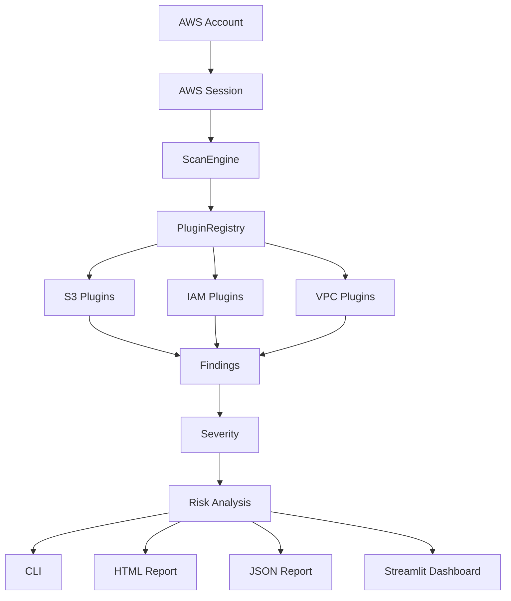
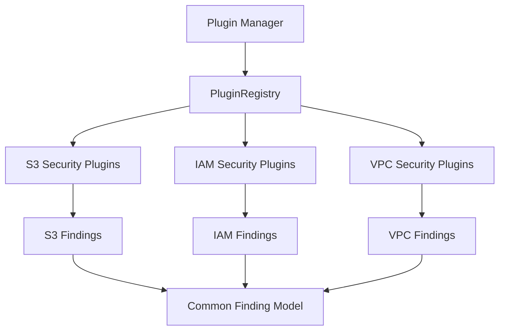
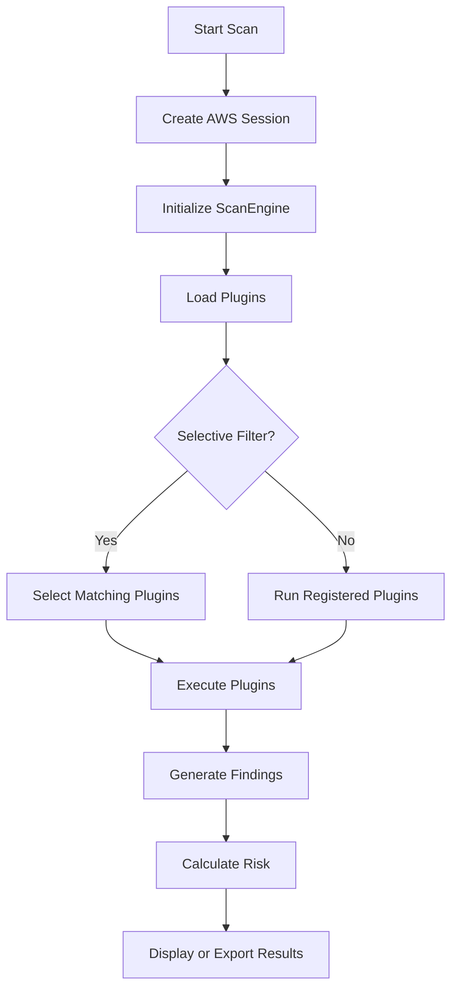
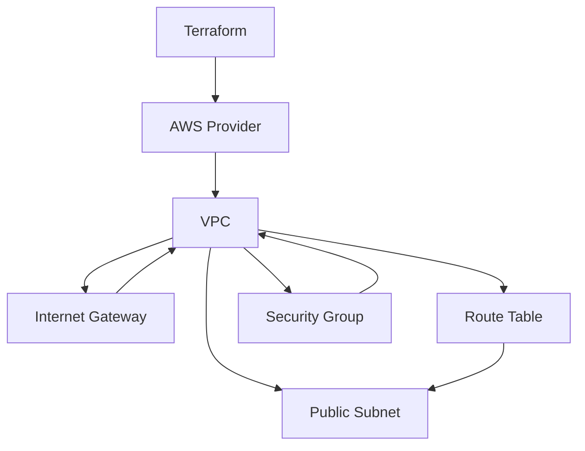
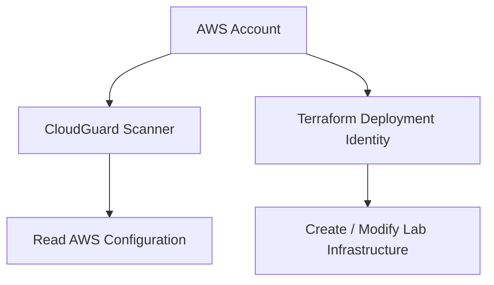
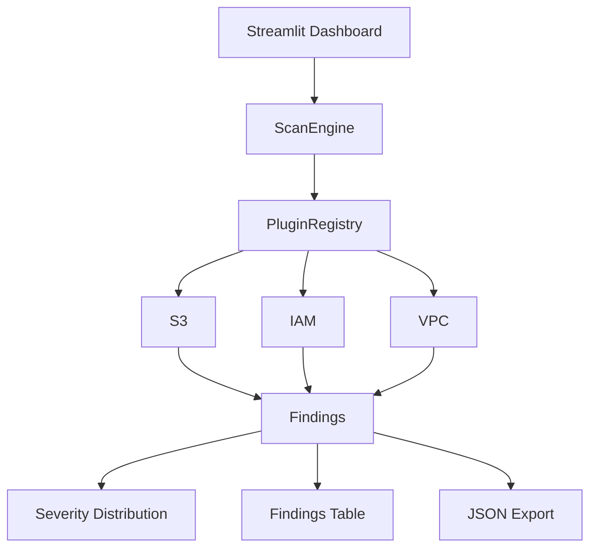
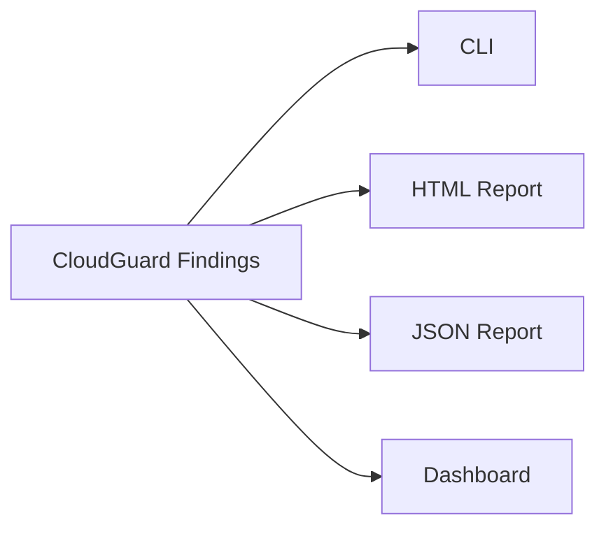
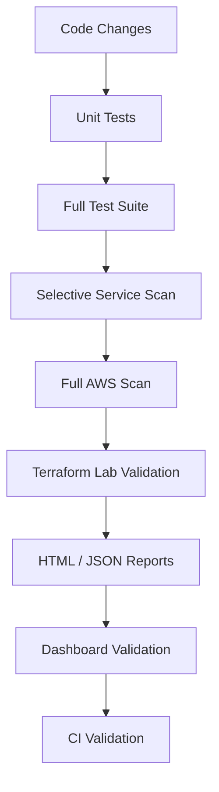

# CloudGuard

[](https://github.com/MohsanRazaq/CloudGuard/actions)

## Overview

CloudGuard follows a plugin-based architecture where individual security checks are separated from the scan engine including cis benchmarking  marching towards attack surface mapping with radius blast.



The goal is not simply to list AWS resources. CloudGuard evaluates their security configuration and converts the results into structured findings.

---

## Current Capabilities
### Main Components

| Component            | Responsibility                 |
| -------------------- | ------------------------------ |
| `cloudguard.py`      | CLI entry point                |
| `ScanEngine`         | Coordinates plugin execution   |
| `PluginRegistry`     | Discovers and manages plugins  |
| `cloudguard/aws/`    | AWS resource discovery         |
| `plugins/`           | Individual security checks     |
| `findings.py`        | Standardized finding model     |
| `risk.py`            | Risk calculation               |
| `posture.py`         | Security posture calculation   |
| `risk_aggregator.py` | Aggregates security risk       |
| `reporting/`         | HTML and JSON reporting        |
| `dashboard/app.py`   | Streamlit dashboard            |
| `tests/`             | Automated security-check tests |
| `Infrastructure/`    | Terraform security lab         |

---

## Plugin Architecture

CloudGuard does not hard-code every security check into the scan engine.

Plugins implement a common interface and are dynamically discovered by the plugin manager.



Each plugin provides metadata such as:

* Name
* Version
* Author
* Description
* Category
* Supported services
* Default severity
* Dependencies
* Mapping to CIS Benchmark

This allows CloudGuard to discover and execute security checks without modifying the core scan engine every time a plugin is added.

---

## Scan Flow

A normal CloudGuard scan follows this process:



The CLI and dashboard use the same `ScanEngine`.

This prevents the dashboard from maintaining a separate scanning implementation.

---

## Security Checks

### S3

| Check                 | Purpose                             |
| --------------------- | ----------------------------------- |
| Bucket Versioning     | Detect disabled versioning          |
| Encryption            | Inspect server-side encryption      |
| ACL                   | Identify insecure ACL configuration |
| Public Access Block   | Check public-access protection      |
| Bucket Policy         | Inspect policy exposure             |
| Server Access Logging | Check logging configuration         |

### IAM

| Check            | Purpose                                              |
| ---------------- | ---------------------------------------------------- |
| User MFA         | Identify IAM users without MFA                       |
| Access Key Usage | Determine access-key usage and last-used information |

### VPC

| Check                   | Purpose                                        |
| ----------------------- | ---------------------------------------------- |
| Public Subnet           | Detect publicly reachable subnet configuration |
| Internet Gateway Route  | Detect routes exposing subnets through an IGW  |
| Public IPv4 Assignment  | Detect automatic public IPv4 assignment        |
| Security Group Exposure | Identify unrestricted inbound access           |
| Network ACL Analysis    | Identify unrestricted inbound NACL rules       |

---

## Risk Model

CloudGuard assigns a severity and risk score to security findings.

The current severity levels are:

```text
CRITICAL
HIGH
MEDIUM
LOW
PASS
```

Example:

```text
[CRITICAL] Security Group Exposure
Risk Score: 10.0/10
```

The risk score is used to prioritize findings.

The overall posture model is intentionally simple and project-specific. It is designed for demonstrating security assessment and prioritization rather than claiming compliance with a particular industry-standard scoring system.

---

## Example Finding

A VPC finding can look like:

```text
------------------------------------------------------------
VPC SECURITY ASSESSMENT
------------------------------------------------------------

[RESOURCE] SubnetId: subnet-example

  [CRITICAL] Route to an Internet Gateway
  Risk Score: 10.0/10

  ISSUE:
  Subnet has a route to an Internet Gateway and enables
  automatic public IPv4 assignment.

  FIX:
  Disable automatic public IP assignment and move backend
  services to private subnets where appropriate.
```

Another example:

```text
[RESOURCE] SecurityGroup: sg-example

  [CRITICAL] Security Group Exposure
  Risk Score: 10.0/10

  ISSUE:
  Entire inbound IPv4 space and all protocols are allowed.

  FIX:
  Restrict inbound traffic to required ports and trusted sources.
```

The exact findings depend on the AWS environment being scanned.

---

## Selective Scanning

CloudGuard supports selective scanning using plugin metadata.

### Scan all supported services

```bash
python cloudguard.py scan
```

### Scan S3

```bash
python cloudguard.py scan --service s3
```

### Scan IAM

```bash
python cloudguard.py scan --service iam
```

### Scan VPC

```bash
python cloudguard.py scan --service vpc
```

### Scan by category

```bash
python cloudguard.py scan --category VPC
```

Selective scanning works by matching the requested service or category against registered plugin metadata.

There is no static `config.json` required for scan selection.

---

## Project Structure

```text
CloudGuard/
|
├── cloudguard.py
├── plugin_manager.py
├── requirements.txt
|
├── cloudguard/
│   ├── aws/
│   │   ├── __init__.py
│   │   ├── session.py
│   │   ├── s3_scanner.py
│   │   └── iam_scanner.py
│   │
│   ├── findings.py
│   ├── posture.py
│   ├── risk.py
│   ├── risk_aggregator.py
│   │
│   ├── reporting/
│   │   ├── summary.py
│   │   ├── html_exporter.py
│   │   └── json_exporter.py
│   │
│   └── utils/
│       └── logger.py
|
├── plugins/
│   ├── s3/
│   ├── iam/
│   └── vpc/
|
├── dashboard/
│   └── app.py
|
├── Infrastructure/
│   ├── variables.tf
│   └── terraform/
│       ├── main.tf
│       ├── outputs.tf
│       └── versions.tf
|
├── tests/
│   ├── s3/
│   ├── iam/
│   ├── vpc/
│   ├── test_posture.py
│   ├── test_risk.py
│   └── test_risk_aggregator.py
|
├── docs/
│   ├── architecture.md
│   ├── vpc_security_model.md
│   └── images/
|
└── .github/
    └── workflows/
        └── tests.yml
```

---

## Infrastructure Lab

CloudGuard includes a Terraform-based AWS lab for testing cloud security checks.

The infrastructure is located under:

```text
Infrastructure/terraform/
```

The current lab includes:

* VPC
* Internet Gateway
* Public subnet
* Route table
* Route table association
* Security Group

The lab intentionally provides network configurations that CloudGuard can identify.



The intended validation process is:

```text
Terraform
    |
    v
Deploy Lab
    |
    v
Run CloudGuard
    |
    v
Detect Security Conditions
    |
    v
Compare Results
```

This provides a reproducible environment for validating the VPC security checks.

---

## AWS Authentication

CloudGuard uses boto3 and the standard AWS credential chain.

For a local development environment:

```bash
aws configure
```

Verify the active identity:

```bash
aws sts get-caller-identity
```

Example:

```text
{
    "UserId": "...",
    "Account": "...",
    "Arn": "arn:aws:iam::ACCOUNT:user/cloudguard_scanner"
}
```

The scanner should use a dedicated read-oriented identity rather than AWS root credentials.

---

## Scanner Permissions

CloudGuard is designed as an assessment tool and does not require write permissions for normal scanning.

The required permissions depend on the checks being executed.

Examples include permissions for:

* S3 bucket discovery
* S3 configuration inspection
* IAM user inspection
* IAM access-key inspection
* VPC inspection
* Subnet inspection
* Route-table inspection
* Security Group inspection
* Network ACL inspection

The scanner identity should follow the principle of least privilege.

For infrastructure deployment, use a separate identity from the CloudGuard scanner.



The CloudGuard scanning identity should not be used as a general-purpose infrastructure deployment identity.

---

## Installation

### Requirements

* Python 3.10+
* AWS account
* AWS CLI
* AWS credentials
* Git

### Clone the repository

```bash
git clone https://github.com/MohsanRazaq/CloudGuard.git
cd CloudGuard
```

### Create virtual environment

Linux/macOS:

```bash
python3 -m venv .venv
source .venv/bin/activate
```

Windows:

```powershell
python -m venv .venv
.venv\Scripts\activate
```

### Install dependencies

```bash
pip install -r requirements.txt
```

### Configure AWS

```bash
aws configure
```

Verify:

```bash
aws sts get-caller-identity
```

---

## Running CloudGuard

Run a complete scan:

```bash
python cloudguard.py scan
```

Scan S3:

```bash
python cloudguard.py scan --service s3
```

Scan IAM:

```bash
python cloudguard.py scan --service iam
```

Scan VPC:

```bash
python cloudguard.py scan --service vpc
```

Scan a category:

```bash
python cloudguard.py scan --category VPC
```

---

## Dashboard

CloudGuard includes a Streamlit dashboard built on top of the same scanning engine used by the CLI.

Run:

```bash
streamlit run dashboard/app.py
```

The dashboard provides:

* Scan execution
* Total finding count
* Scan execution time
* Security severity distribution
* Findings table
* JSON export

The dashboard follows the same architecture:



This means the CLI and dashboard evaluate the same underlying security checks.

---

## Reporting

CloudGuard supports multiple output formats.



### CLI

Human-readable output for interactive scans.

### HTML

A report format suitable for reviewing assessment results.

### JSON

Machine-readable findings suitable for automation and further processing.

Example:

```json
{
    "finding_id": "example",
    "severity": "HIGH",
    "risk_score": 8.0,
    "category": "S3",
    "resource": "example-bucket",
    "check": "Bucket Security Check",
    "issue": "Security configuration requires review",
    "recommendation": "Apply the recommended security configuration"
}
```

---

## Testing

CloudGuard uses pytest for automated testing.

Run the complete test suite:

```bash
pytest -v
```

The test suite covers:

* S3 security checks
* IAM security checks
* VPC security checks
* Risk calculation
* Risk aggregation
* Security posture

The project also uses GitHub Actions to run automated tests in CI.

---

## Validation Strategy

CloudGuard is tested at multiple levels.



This provides validation across both individual security checks and the complete scanning workflow.

---

## Security Considerations

CloudGuard is an assessment tool and should not be treated as a complete cloud security program.

Important considerations:

* Scanner results depend on the permissions available to the scanner identity.
* A `PASS` result means that the implemented check did not identify the tested condition. It does not prove that the resource is completely secure.
* Risk scores are project-specific heuristics.
* AWS findings should be validated against the actual environment.
* Infrastructure changes should be tested before applying them to production environments.
* AWS credentials and secrets must never be committed to the repository.
* Terraform changes should be reviewed before deployment.
* The scanner should use least-privilege credentials wherever practical.

---

## CloudGuard v1

CloudGuard v1 is intentionally scoped to three AWS security domains:

```text
S3
IAM
VPC
```

### Completed

* [x] Dynamic plugin architecture
* [x] Plugin registry
* [x] S3 security assessment
* [x] IAM security assessment
* [x] VPC security assessment
* [x] Public subnet exposure detection
* [x] Internet Gateway route detection
* [x] Security Group exposure analysis
* [x] Network ACL analysis
* [x] Severity classification
* [x] Risk scoring
* [x] CLI reporting
* [x] HTML reporting
* [x] JSON reporting
* [x] Streamlit dashboard
* [x] Selective service scanning
* [x] Selective category scanning
* [x] Automated tests
* [x] GitHub Actions CI
* [x] Terraform security lab

### Scope Boundary

CloudGuard v1 intentionally stops at:

```text
S3
IAM
VPC
```

The project is not being expanded into additional AWS services as part of v1.

The purpose of this boundary is to keep the current implementation focused, tested, documented, and reproducible rather than continuously increasing service coverage without equivalent depth.

---

## Project Status

CloudGuard v1 is a functional cloud security posture assessment prototype.

Current implementation includes:

```text
AWS
 |
 +-- S3
 |
 +-- IAM
 |
 +-- VPC
      |
      +-- Subnets
      +-- Route Tables
      +-- Security Groups
      +-- Network ACLs
 |
 v
Plugin Architecture
 |
 v
ScanEngine
 |
 v
Findings
 |
 +-- Severity
 +-- Risk
 |
 +-- CLI
 +-- HTML
 +-- JSON
 +-- Dashboard
```

The focus is now on validation, documentation, reliability, and reproducibility rather than expanding the service list.

---

## Why I Built CloudGuard

CloudGuard was built as a practical cloud security engineering project.

Instead of treating a security scanner as a black box, the project implements the major components involved in a cloud security assessment system:

* AWS API interaction
* boto3
* IAM security
* Network security
* Security Group analysis
* Network ACL analysis
* Cloud security posture assessment
* Plugin architecture
* Risk modeling
* Automated testing
* Infrastructure as Code
* Security reporting
* Dashboard visualization

The project is designed around real AWS APIs and real cloud infrastructure.

---

## Author

**Mohsan Razaq**

BS Cyber Security

Cloud Security and Offensive Security

---

## License

See the repository for the applicable license.

````

